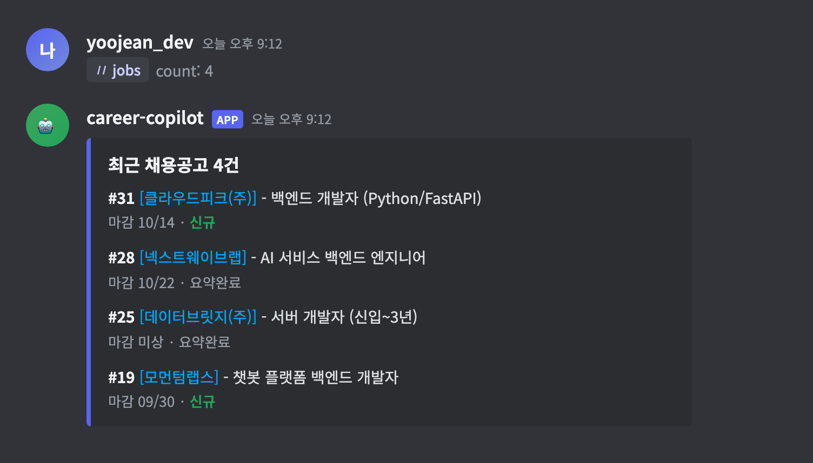
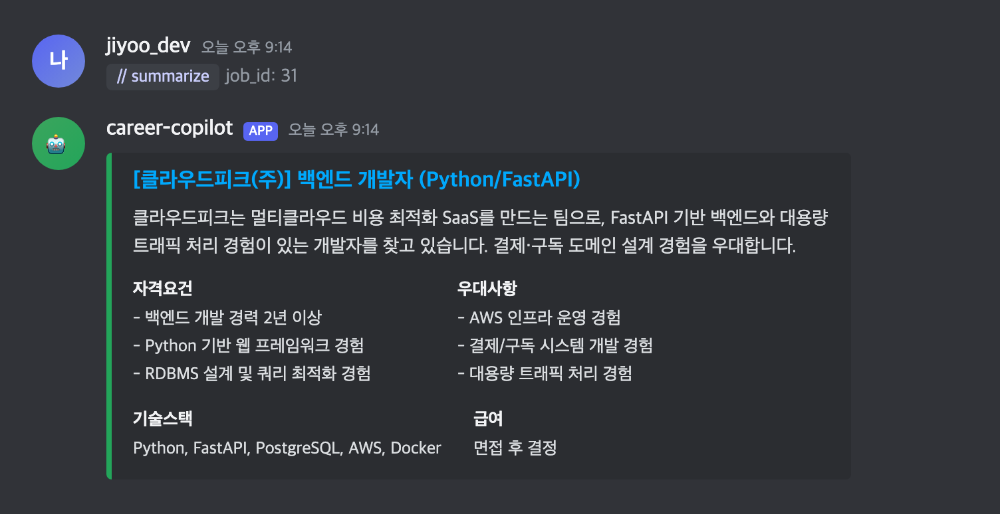
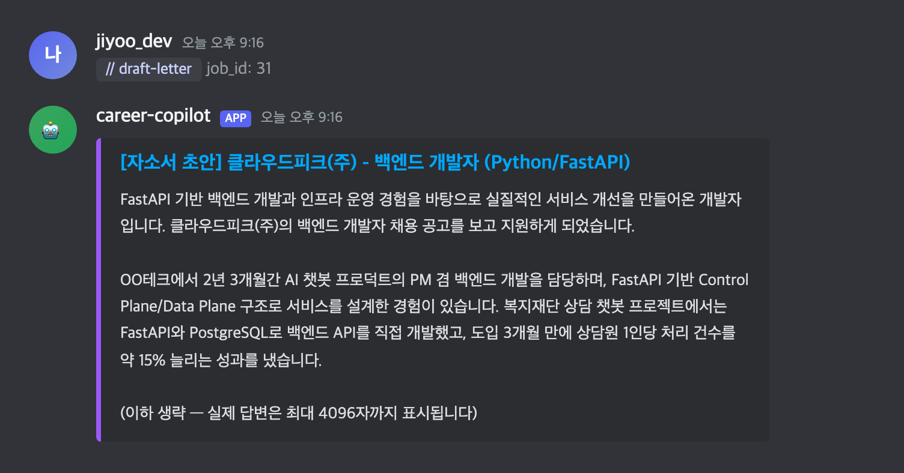

# Career Copilot

[](https://github.com/yoo-jean/career-copilot/actions/workflows/tests.yml)
[](LICENSE)

이직 준비 올인원 봇 — 관심 기업/직무 채용공고 크롤링, LLM 기반 요약, RAG 기반 자소서/면접 답변 초안 생성을 Discord 봇으로 제공합니다.

## 스크린샷

> 아래 화면은 데모용 더미 데이터로 재현한 것입니다 (실제 크롤링 데이터의 회사명은 공개하지 않습니다).

| `/jobs` — 최근 채용공고 목록 | `/summarize` — 공고 요약 |
|---|---|
|  |  |

| `/draft-letter` — 자소서 초안 생성 |
|---|
|  |

## 아키텍처

- `crawler/` — 사이트별 채용공고 크롤러
- `llm/` — 공고 요약 (Claude / OpenAI)
- `rag/` — 개인 경력 데이터 임베딩 + 자소서/면접답변 생성 (Chroma)
- `bot/` — Discord 인터페이스
- `core/` — DB 모델(SQLAlchemy) 및 세션 관리
- `config/` — 환경변수 기반 설정

로컬 개발은 SQLite + Chroma(둘 다 `data/` 하위 파일 기반)로 동작하며, `DATA_DIR` 환경변수만 바꾸면 Railway/Fly.io 같은 클라우드의 마운트 볼륨 경로로도 동일 코드가 그대로 동작합니다.

## 시작하기

```bash
python3 -m venv .venv
source .venv/bin/activate
pip install -r requirements-dev.txt
cp .env.example .env   # API 키 채워넣기
pytest
```

## 데이터 정책

`data/`, `rag/corpus/`는 `.gitignore` 처리되어 있으며, 실제 회사명/지원 정보 등 민감 데이터는 절대 커밋하지 않습니다. 포트폴리오 공개 시에는 `fixtures/`의 더미 데이터로 데모합니다.

## 배포 (Discord bot만 Fly.io로)

**크롤러/LLM 요약/RAG ingest는 로컬에서만 실행**하고, **Discord bot 프로세스만** Fly.io에 올려서 상시 운영합니다. 봇이 쓰는 SQLite DB와 Chroma 벡터스토어는 로컬에서 만든 걸 볼륨에 업로드하는 방식입니다 (양방향 실시간 동기화가 아니라 스냅샷 업로드입니다 — 아래 유의사항 참고).

### 최초 설정 (한 번만)

```bash
# 1. flyctl 설치 (macOS)
brew install flyctl

# 2. 로그인 (브라우저 열림)
fly auth login

# 3. 앱 생성 — 프로젝트 루트에서 실행, 대화형으로 앱 이름/리전 물어봄
#    "배포할까요?"에는 No — 볼륨/시크릿 먼저 설정해야 함
fly launch --no-deploy

# 4. 영구 볼륨 생성 (fly.toml의 mounts.source 이름과 반드시 일치해야 함)
fly volumes create career_copilot_data --size 1 --region <위에서 고른 리전>

# 5. API 키/토큰을 시크릿으로 등록 (절대 fly.toml이나 코드에 넣지 않음)
fly secrets set \
  DISCORD_BOT_TOKEN=... \
  ANTHROPIC_API_KEY=... \
  OPENAI_API_KEY=... \
  DISCORD_GUILD_ID=...
```

### 배포 및 데이터 업로드

```bash
# 최초 1회: 로컬 data/ 를 볼륨에 업로드
./scripts/sync_to_fly.sh <fly-app-name>

# 배포
fly deploy

# 이후 로컬에서 새로 크롤링/요약/ingest 했으면 다시 동기화
./scripts/sync_to_fly.sh <fly-app-name>
fly apps restart <fly-app-name>
```

### 유의사항

- **한쪽 방향 동기화입니다.** 로컬 → 클라우드로만 스냅샷을 올립니다. 클라우드에서 `/summarize`나 `/draft-letter`로 새로 생성된 요약·초안은 클라우드 볼륨에만 쌓이고 로컬로 자동으로 안 내려옵니다.
- `fly.toml`의 `[[mounts]] destination = "/data"`가 `DATA_DIR=/data` 환경변수와 맞물려서, 코드 변경 없이 로컬/클라우드 전환이 됩니다 (설계 단계부터 의도한 부분).
- 무료 티어 한도나 카드 등록 여부는 Fly.io 정책이 계속 바뀌니 배포 전에 [fly.io/pricing](https://fly.io/pricing)에서 최신 조건을 확인하세요.
